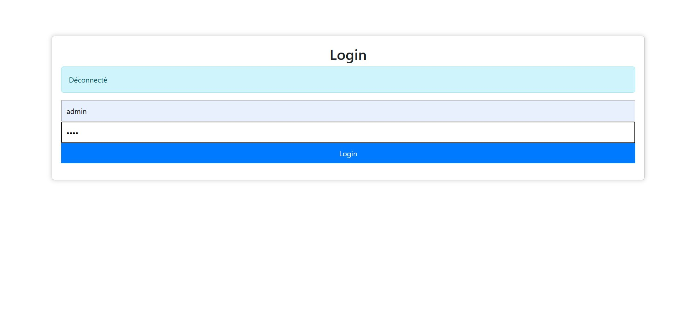
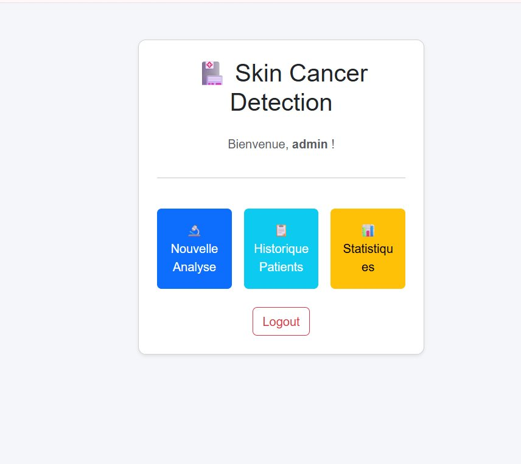
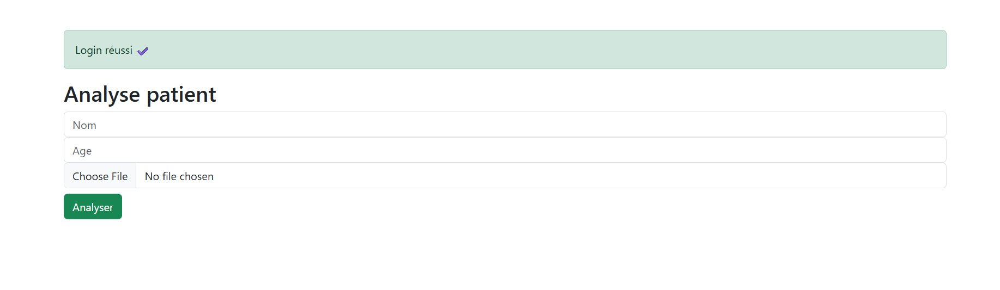
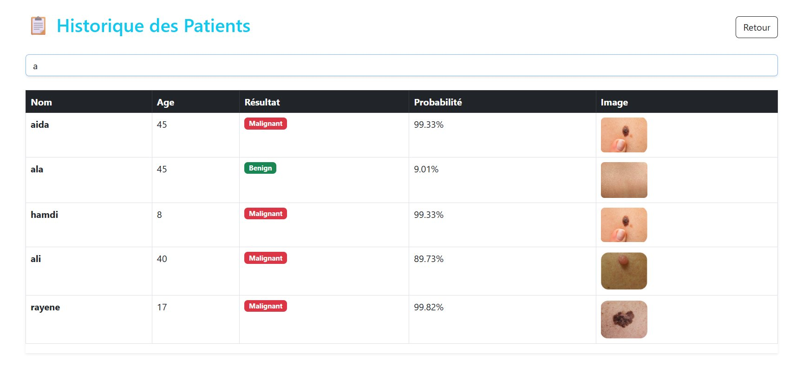
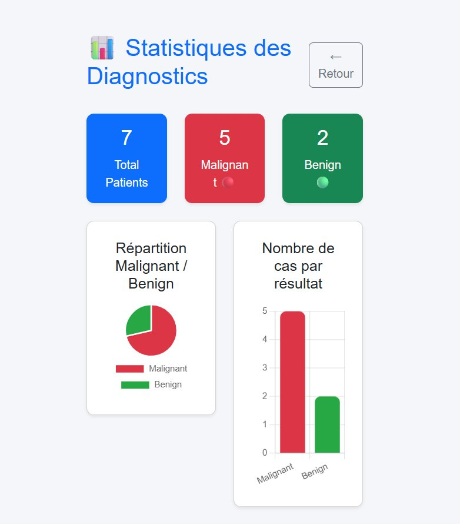

# 🔬 Skin Cancer Detection App

Application Web Flask intégrant un modèle Deep Learning (VGG16) pour la détection de cancer cutané (Bénin / Malin).

---

## 📸 Aperçu de l'Application

### 🔐 Login


### 🏠 Dashboard


### 🔬 Analyse Patient


### 📋 Historique des Patients


### 📊 Statistiques


---

## 📋 Prérequis

- Python 3.x
- XAMPP (MySQL)
- Bibliothèques :
```
pip install flask tensorflow numpy mysql-connector-python
```

---

## 🗂️ Structure du Projet

```
SKIN_CANCER_APP/
├── app.py                        # Logique principale Flask
├── database.sql                  # Script de création de la base de données
├── README.md                     # Documentation
├── model/
│   └── vgg16_skin_cancer.h5      # Modèle pré-entraîné (à fournir)
├── static/
│   ├── style.css                 # Styles CSS
│   └── uploads/                  # Images uploadées par les utilisateurs
└── templates/
    ├── login.html                # Page de connexion
    ├── dashboard.html            # Tableau de bord
    ├── predict.html              # Formulaire d'analyse
    ├── result.html               # Résultat du diagnostic
    ├── patients.html             # Historique des patients
    └── stats.html                # Statistiques graphiques
```

---

## 🚀 Installation et Lancement

### 1. Base de données
1. Démarrer **XAMPP** → lancer **Apache** et **MySQL**
2. Ouvrir **phpMyAdmin** → `http://localhost/phpmyadmin`
3. Aller dans **Importer** → choisir `database.sql` → Exécuter

   Cela crée :
   - La base `skin_cancer_db`
   - La table `users` (avec l'utilisateur admin/1234)
   - La table `patients`

### 2. Modèle IA
- Placer le fichier `vgg16_skin_cancer.h5` dans le dossier `model/`

### 3. Lancer l'application
```bash
python app.py
```
- Ouvrir le navigateur : `http://localhost:5000`
- **Login :** admin / **Mot de passe :** 1234

---

## 🧭 Routes de l'Application

| Route        | Méthode   | Description                              |
|--------------|-----------|------------------------------------------|
| `/`          | GET/POST  | Page de connexion                        |
| `/dashboard` | GET       | Tableau de bord (accès protégé)          |
| `/predict`   | GET/POST  | Analyse d'une image de lésion cutanée    |
| `/patients`  | GET       | Historique de tous les patients          |
| `/stats`     | GET       | Statistiques graphiques (Pie + Bar chart)|
| `/logout`    | GET       | Déconnexion                              |

---

## 🤖 Fonctionnement du Modèle IA

1. L'utilisateur uploade une image de lésion cutanée
2. L'image est redimensionnée à **224×224** pixels
3. Normalisation des pixels (division par 255.0)
4. Passage dans le modèle **VGG16** pré-entraîné
5. Si la prédiction > 0.5 → **Malignant**, sinon → **Benign**
6. Le résultat est sauvegardé dans la base de données MySQL

---

## 📊 Statistiques

La page `/stats` affiche :
- Nombre total de patients analysés
- Nombre de cas **Malignant** et **Benign**
- **Graphique circulaire** (Pie chart) de répartition
- **Graphique en barres** (Bar chart) de comparaison

---

## 🗄️ Base de Données

**Table `users`**
| Colonne  | Type         |
|----------|--------------|
| id       | INT (PK)     |
| username | VARCHAR(50)  |
| password | VARCHAR(50)  |

**Table `patients`**
| Colonne      | Type         |
|--------------|--------------|
| id           | INT (PK)     |
| name         | VARCHAR(100) |
| age          | INT          |
| result       | VARCHAR(20)  |
| probability  | FLOAT        |
| image_path   | VARCHAR(255) |
| created_at   | TIMESTAMP    |

---

## 👩‍🏫 Informations TP

- **Module :** Technologies Avancées (1TA)
- **TD 8 :** Développement d'une Application Web IA (Partie 1 & 2)
- **Enseignante :** Amira Echtioui
